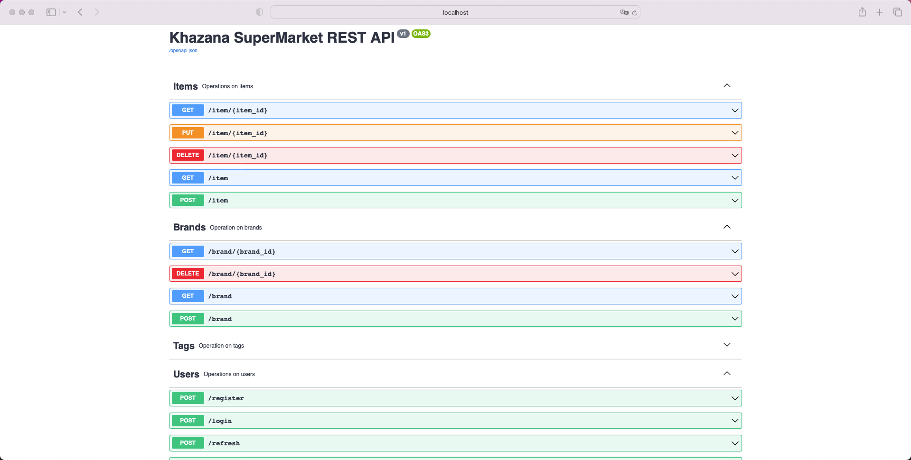
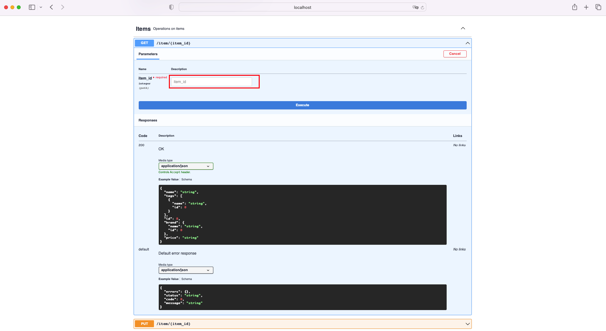

# SuperMarketAPI
This api will be connect with the frontend of the supermarket. We can access individual brand specific items and their availability with pricing and much more information.

Below are the API Documentation which I've built to perform various functionality within the supermarket.

**Below is the sample walkthrough *GET* API for getting all the items within the store :**
As highlighted below, **item_id** is keyword user needs to provide to received item details for the given **item_id**.  

## License
